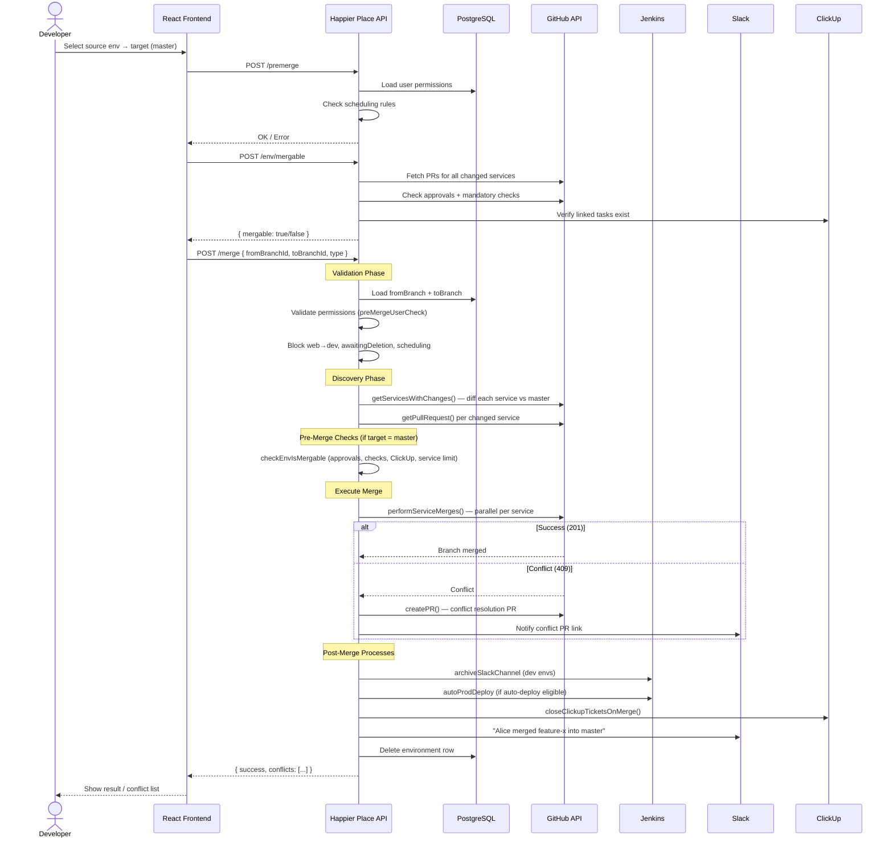
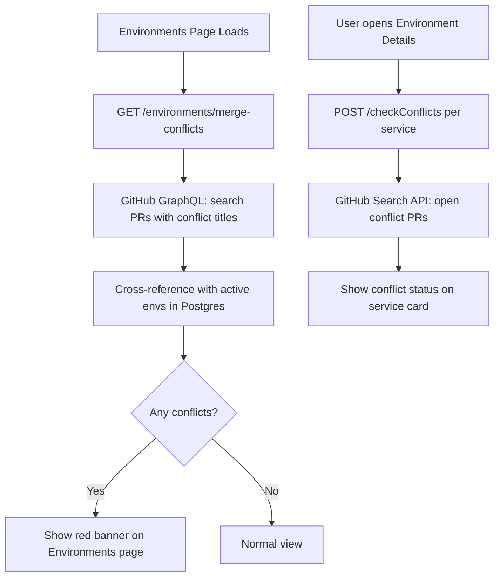
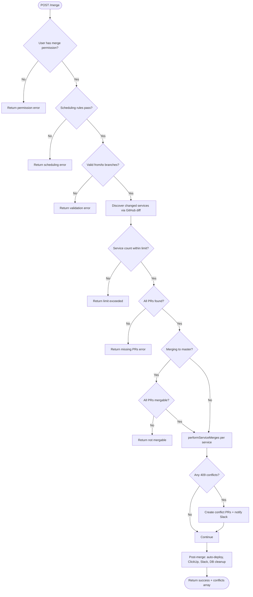

# Happier Place — Interview Prep Guide

> **Purpose:** Read this before your interview. It covers a 2-minute pitch, common Q&A, and a merge-flow diagram for system design rounds.

---

## Table of Contents

1. [2-Minute Verbal Script](#1-2-minute-verbal-script-memorize-this)
2. [Likely Interview Questions & Answers](#2-likely-interview-questions--answers)
3. [Merge Flow Diagram (System Design)](#3-merge-flow-diagram-system-design-round)
4. [Quick Reference Cheat Sheet](#4-quick-reference-cheat-sheet)

---

## 1. Two-Minute Verbal Script (Memorize This)

> **Tip:** Speak at a calm pace. This script is ~2 minutes when read naturally.

---

**"I built Happier Place — an Internal Developer Platform for our engineering teams.**

**The problem:** We had dozens of microservices, each with its own `env/*` branch in GitHub. Creating an environment meant manually triggering Jenkins jobs, checking PR status across repos, and coordinating merges. It was slow, error-prone, and only a few people knew the full process.

**My solution:** A React frontend and a Node/Express backend that acts as a single control plane. Developers log in with Google SSO, and from one UI they can create environments, run tests, toggle sportsbook feeds, view GitHub diffs, and merge to master.

**On the frontend**, I used React with Recoil for state management and a dedicated `commands` layer — so UI components never call APIs directly. Each page maps to a clear route: Environments list, Environment Details, Controls for create/merge/delete, and Non-Env PRs for changes not tied to an environment.

**On the backend**, Express + TypeScript talks to PostgreSQL for environments, users, and role-based permissions. For anything that touches infrastructure — provisioning, scaling, running the Iron Curtain test suite — we delegate to Jenkins jobs. For Git operations — branch checks, PR status, merges — we use the GitHub API and GraphQL.

**The two environment types are important:** A **Dev environment** is a full isolated Kubernetes namespace cloned from master. A **Web environment** is frontend-only — your React changes run separately but routing pipes back to the shared K8s cluster.

**The merge flow is the most complex part.** Before merging, we validate permissions, release scheduling rules, PR approvals, mandatory GitHub checks, ClickUp ticket linkage, and service count limits. Then we merge each service's branch in parallel via GitHub. If a service has conflicts, we create a conflict-resolution PR and surface it in the UI. After a successful merge to master, we optionally trigger auto-deploy, close ClickUp tickets, archive the Slack channel, and clean up the environment record.

**The impact:** Environment creation went from a multi-step manual process to one form. Merge readiness is visible across all services in one place. We have Slack notifications and an audit trail for every action.

**That's Happier Place — a developer self-service platform that orchestrates GitHub, Jenkins, ClickUp, and Postgres behind one authenticated UI."**

---

## 2. Likely Interview Questions & Answers

---

### Q1: What is Happier Place and why did you build it?

**Answer:**

Happier Place is an Internal Developer Platform (IDP). Engineering teams use it to manage isolated cloud development environments across many microservices.

Before it existed, creating an environment required manual Jenkins jobs, checking GitHub branches repo by repo, and tribal knowledge about merge procedures. I built a unified UI + API so developers could self-serve: create envs, monitor status, run tests, and merge — all from one place.

---

### Q2: How does authentication work?

**Answer:**

We use **Google SSO** with a **JWT session** on top.

**Flow:**
1. User clicks "Login with Google" on the React app (`@react-oauth/google`).
2. Google returns an access token.
3. Frontend calls `GET /auth/google/callback?access_token=...`.
4. Backend validates the token with Google's API — checks email is verified and not expired.
5. Backend looks up the user by email in Postgres. If they exist, we issue a **JWT** signed with our secret.
6. Frontend stores the JWT in `localStorage` and an Axios interceptor attaches it as `Authorization` on every request.
7. Backend middleware (`registerUserAuthenticationMiddleware`) verifies the JWT on each request, loads the user + role permissions from DB, and attaches `req.user`.
8. On token expiry or invalid token, the frontend auto-logs out via an Axios response interceptor.

**Role-based permissions** live in the `user_roles` table: flags like `merge_master`, `create_dev`, `delete`, etc. Merge and create operations check these before proceeding.

**Some endpoints are on an exclusion list** (e.g. `/list`, `/auth/google/callback`) for unauthenticated or internal access. Internal cron jobs use `x-internal-api-token` header instead.

---

### Q3: How do you handle merge conflicts?

**Answer:**

We handle conflicts at **three levels** — detection, prevention, and resolution.

#### Detection (before merge)
- `GET /environments/merge-conflicts` queries GitHub GraphQL for open PRs with conflict markers in the title.
- It cross-references those with active environments in our DB and shows a **red banner** on the Environments page for affected envs.
- Per-service: `POST /checkConflicts` searches GitHub for open conflict PRs like `"Merge conflicts from master to env/my-feature"`.

#### Prevention (before merge executes)
- `POST /env/mergable` checks: all PRs approved, mandatory GitHub checks green, ClickUp tasks linked, service count within limit, release choreography valid.
- `POST /premerge` validates scheduling rules and user permissions.
- If merging to master and checks fail → merge is blocked with a clear error message.

#### Resolution (during merge)
- `performServiceMerges()` loops each changed service and calls GitHub's merge API.
- If GitHub returns **409 (conflict)**:
  1. Service name is added to `conflictsArray`.
  2. We auto-create a **conflict-resolution PR** via `createPR()`.
  3. Slack is notified with the PR link.
- Merge continues for other services (parallel via `Promise.all`).
- Frontend receives `conflictsArray` in the response and shows which services need manual resolution.
- Environment may be marked `awaitingDeletion` until conflicts are resolved.

**Key point for interview:** We don't silently fail — conflicts are surfaced immediately in UI + Slack, and developers resolve them in GitHub before re-attempting merge.

---

### Q4: Walk me through the environment merge flow end-to-end.

**Answer:**

See [Section 3 — Merge Flow Diagram](#3-merge-flow-diagram-system-design-round) for the visual. Verbally:

1. **User** selects source env (e.g. `feature-x`) and target (e.g. `master`) on Controls page.
2. **Frontend** calls `POST /premerge` → validates scheduling + permissions.
3. **Frontend** calls `POST /env/mergable` → checks all PRs are green.
4. **Frontend** calls `POST /merge` with `{ fromBranchId, toBranchId, type }`.
5. **Backend** loads both environments from Postgres, validates rules (no web→dev merge, not already awaiting deletion, etc.).
6. **Backend** discovers changed services via `getServicesWithChanges()` — compares each service's env branch commit vs master.
7. **Backend** fetches GitHub PR for each changed service.
8. If target is master → runs full mergability check (approvals, checks, ClickUp, limits).
9. **Backend** calls `performServiceMerges()` — parallel GitHub branch merges per service.
10. **Post-merge:** archive Slack channel, trigger auto-deploy if eligible, close ClickUp tickets, post Slack summary, delete env row from DB.
11. **Frontend** shows success or lists conflicting services.

---

### Q5: What are Dev vs Web environments?

**Answer:**

| Type | What it is | Branch pattern | Use case |
|------|-----------|----------------|----------|
| **Dev** | Full isolated K8s namespace — all lambdas, services, queues, DB snapshot | `env/{name}` | Backend + full-stack feature work |
| **Web** | Frontend-only — React apps run separately, routing pipes to master K8s | `web-env/{name}` | UI-only changes without full env cost |

Web environments can only merge to master or other web environments — never into a dev environment. This is enforced in the merge logic.

---

### Q6: What is the Iron Curtain?

**Answer:**

The Iron Curtain is our **backend end-to-end test suite**. From Environment Details, a developer selects a test script and clicks Run. The frontend calls `POST /ironcurtain`, which triggers a Jenkins job with the env name, branch, cluster, and script. Results are polled via `GET /jobinfo` and scored via `POST /ticScore`. A Slack notification is sent when tests start.

---

### Q7: How does environment creation work?

**Answer:**

1. User fills form on Controls page: name, cluster, type (dev/web), casino/sportsbook flags.
2. `POST /create` → backend validates user has `create_dev` or `create_web` permission.
3. `checkMissingBranches()` loops all registered services and checks if `env/{name}` or `web-env/{name}` already exists in GitHub.
4. `validateCreateEnvironment()` checks name format, duplicates in DB, etc.
5. Jenkins job is triggered to provision infrastructure (namespace, lambdas, routing, DB snapshot for dev).
6. Row inserted in `environments` table in Postgres.
7. Slack notification: "Alice created Dev env feature-x with Casino ENABLED & Sportsbook DISABLED".

---

### Q8: What third-party systems does Happier Place integrate with?

**Answer:**

| System | Purpose |
|--------|---------|
| **GitHub** | Branch management, PR status, merges, conflict detection, GraphQL for non-env PRs |
| **Jenkins** | Env provisioning, scaling, test runs (Iron Curtain, webapp, backoffice), auto-deploy |
| **ClickUp** | Task tracking per environment; tickets closed on merge |
| **Slack** | Notifications for create, merge, test runs, conflicts |
| **Google OAuth** | SSO login |
| **Firebase App Distribution** | Mobile build check before triggering iOS/Android builds |
| **Datadog** | Deeplinks from UI (no direct API — Emergency Links page) |

---

### Q9: How did you structure the frontend?

**Answer:**

- **`commands/`** — API client layer (e.g. `environments.ts`, `controls.ts`, `envTests.ts`). Components call these, not Axios directly.
- **`state/`** — Recoil atoms: `environmentsState`, `userState`, `navigationState`, `promptsState`.
- **`containers/`** — Page-level components wired to routes.
- **`components/`** — Reusable UI: LEDs for status, toolbars, cards, dialogs.
- **`PromptsHandler`** — Global modals (commits viewer, test results, ClickUp tasks, merge info).
- **Lazy loading** — Routes use `React.lazy()` for code splitting.
- **Axios interceptors** — Auto-attach JWT; auto-logout on 401.

---

### Q10: How did you structure the backend?

**Answer:**

- **`index.ts`** — Express app, middleware registration, route mounting.
- **`lib/routes/`** — Route modules (auth, user, environment, feeds, iron-curtain, mobile-builds).
- **`lib/environments/`** — Core business logic (create, merge, delete, get, active, scale, etc.).
- **`lib/middlewares/`** — Auth, logging, error handling, async wrapper.
- **`lib/models/`** — DB access (Knex queries for users, environments, services).
- **`lib/schemas/`** — Zod validation for request bodies.
- **`lib/utils/github.ts`** — GitHub API helpers (merge, create branch, check conflicts).
- **`lib/utils/jenkinsapi.ts`** — Jenkins job triggers.
- **`migrations/`** — Knex DB migrations.
- **`tests/integration/`** — Mocha + Supertest + Docker Compose; mocks for GitHub/Jenkins.

---

### Q11: What is role-based access control? Give an example.

**Answer:**

Each user has a `user_role_id` linked to `user_roles` table with boolean permission flags:

- `create_dev`, `create_web`
- `merge_dev`, `merge_web`, `merge_master`
- `delete`, `add_user`, `delete_user`

**Example:** A `DEVELOPER` role has `merge_dev: true` but `merge_master: false`. If they try to merge an environment to master, `preMergeUserCheck()` returns: *"Sorry you don't have permission to merge to an environment with type master."*

Only `ADMIN` or specific senior roles get `merge_master`.

---

### Q12: What are Non-Env PRs?

**Answer:**

PRs that are **not** tied to an `env/*` or `web-env/*` branch — typically direct feature branches going to master. They appear on the `/non-env-prs` page, fetched via GitHub GraphQL (`GET /pull-requests/list`).

Merging uses `POST /pull-request/merge` which requires `merge_master` permission and runs the same conflict handling + auto-deploy + ClickUp close flow as environment merges.

---

### Q13: What is auto-deploy?

**Answer:**

Some environments are flagged `is_auto_deployable`. After a successful merge to master, if all auto-deploy checks pass (valid release choreography, checks green, etc.), we trigger a Jenkins `autoProdDeploy` job to deploy changed services to production automatically — without a manual release step.

If the check fails, merge still succeeds but deploy is manual.

---

### Q14: How do you test the backend?

**Answer:**

Integration tests using Mocha, Supertest, Chai, and Docker Compose for Postgres. We mock external APIs (GitHub, Jenkins, ClickUp, Slack) with Nock. Tests cover:

- Environment CRUD
- Merge flows (happy path + permission denied + scheduling blocked)
- Iron Curtain triggers
- Non-env PR merge
- Mobile build trigger
- Auth and user permissions

Because Happier Place doesn't run on K8s itself, we can't do full E2E against real Jenkins — so integration tests with mocks are our safety net.

---

### Q15: What would you improve if you rebuilt it today?

**Answer (shows maturity):**

1. **Database transactions** — merge post-processes (Slack, auto-deploy, DB delete) aren't wrapped in a transaction; a failure mid-flow can leave inconsistent state.
2. **Don't delete merged env rows** — mark status as `MERGED` instead of deleting from DB (there's even a TODO comment for this).
3. **Event-driven architecture** — replace synchronous Jenkins calls with a job queue (SQS/RabbitMQ) for better resilience and retries.
4. **WebSocket updates** — instead of polling Jenkins for test results, push status via WebSockets.
5. **API versioning** — many endpoints are `POST /list`, `POST /merge` with no REST naming convention; would standardize to `/api/v1/environments`.

---

## 3. Merge Flow Diagram (System Design Round)

Use this diagram when asked: *"Draw the merge flow"* or *"How does merging work?"*

### High-Level Merge Flow

### Merge Conflict Detection (Separate Flow)

### Merge Decision Tree (Simplified)

---

## 4. Quick Reference Cheat Sheet

### Frontend Pages

| Route | Page | Key Actions |
|-------|------|-------------|
| `/login` | Google SSO | Authenticate |
| `/environments` | Env list | View all, drag priority, conflict banner |
| `/environment-details/:type/:id` | Env details | Tests, feeds, GitHub, DB, monitoring |
| `/controls` | Admin controls | Create, delete, merge envs; create services |
| `/non-env-prs` | Non-env PRs | View/merge PRs not on environments |
| `/emergency-links` | Runbooks | Datadog, AWS, Slack links |

### Key API Endpoints (Top 20)

| Method | Endpoint | What it does |
|--------|----------|--------------|
| `GET` | `/auth/google/callback` | Login → JWT |
| `GET` | `/me` | User + permissions |
| `POST` | `/list` | All environments |
| `POST` | `/create` | Create environment |
| `POST` | `/delete` | Delete environment |
| `POST` | `/merge` | Merge environments |
| `POST` | `/premerge` | Pre-merge validation |
| `POST` | `/env/mergable` | Can env merge? |
| `POST` | `/diff` | Git diffs per service |
| `POST` | `/checkConflicts` | Conflict check per service |
| `GET` | `/environments/merge-conflicts` | All envs with conflicts |
| `POST` | `/ironcurtain` | Run E2E tests |
| `POST` | `/active` | Turn env on/off |
| `POST` | `/scale` | Scale K8s services |
| `PATCH` | `/environment/:id` | Update priority/status |
| `GET` | `/pull-requests/list` | Non-env PRs |
| `POST` | `/pull-request/merge` | Merge non-env PR |
| `POST` | `/mobile-build/trigger` | Trigger mobile build |
| `POST` | `/integrations/clickup/team/:id/task` | ClickUp tasks |

### Tech Stack One-Liner

**Frontend:** React 18 · TypeScript · Material UI · Recoil · React Router · Axios

**Backend:** Express · TypeScript · PostgreSQL · Knex · JWT · Zod · Jenkins · GitHub API

### Numbers to Remember

- **2 environment types:** Dev (full K8s) and Web (frontend-only)
- **Permissions checked before every merge:** role + scheduling + PR status + service limit
- **409 from GitHub** = conflict → auto-create resolution PR
- **Post-merge:** Slack + ClickUp + optional auto-deploy + DB cleanup

---

## Final Tips for the Interview

1. **Start with the problem**, not the tech stack.
2. **Use "I"** — "I designed the commands layer…", "I implemented the merge conflict detection…"
3. **Draw the merge diagram** if asked about system design — interviewers love sequence diagrams.
4. **Mention trade-offs** — shows senior thinking (e.g. no DB transactions, synchronous Jenkins calls).
5. **Know the conflict flow cold** — it's the most likely deep-dive question.
6. **Have one story ready** — e.g. "A developer merged 12 services and 2 had conflicts — the UI showed exactly which repos needed resolution PRs, and Slack notified the team."

---

*Good luck! You've got this.*
